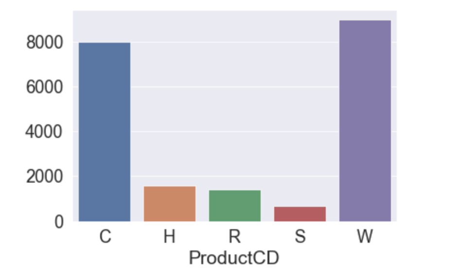
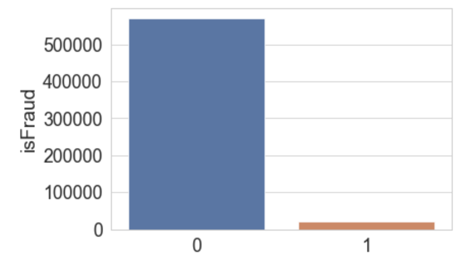
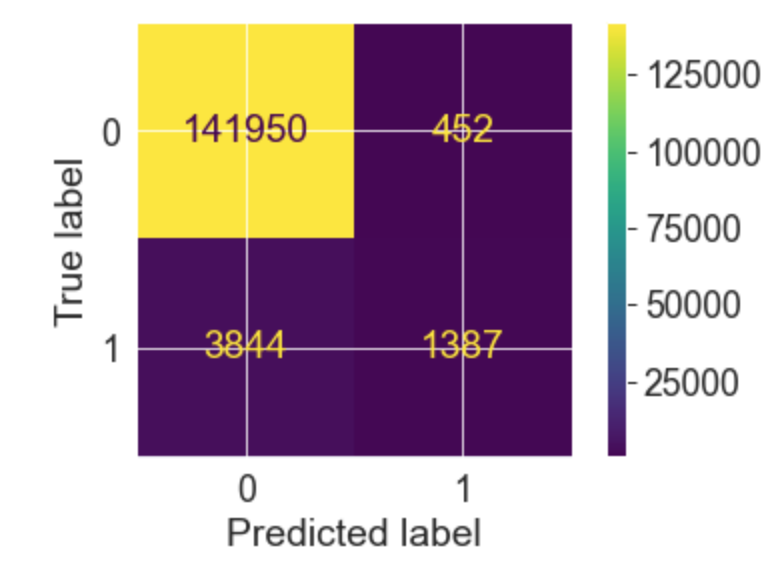
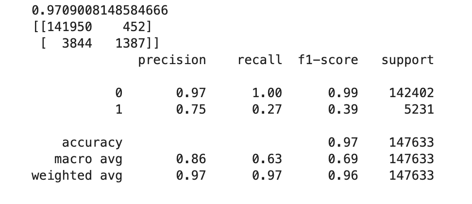

# Fraud

# Repo Contents 

I got my data here [Data](https://www.kaggle.com/c/ieee-fraud-detection/data). Create a data folder in your jupyter notebook and import the Train_Transaction set as a CSV file to that data folder. 

Notebook - Here is my EDA notebook. It's pretty rough, but it has the other models I ran. 

[Report](Report) Slides are in here individually and the final notebook is [here](Report/FInal.ipynb) . 
 
Fraud.yml - Contains all of the packages needed to run the code in this project

# Business Case

Nearly everyone has been here. You're at the mall, decide to splurge, maybe on some concert tickets, a fresh new pair of shoes, some designer jeans, whatever. You get to the register all set to make your purchase and, whoops, CARD DECLINED. You try your card again, and still, declined. You panic, frantically checking your account to make sure that you haven't been hacked, search for other cards in your wallet that don't exist. The cashier stares at you, awkwardly, before nodding to the person behind you in line to take your place. That is, until you get a text from the bank: "Did you try to make this purchase?" Releived you select yes, hop back in line, swipe your card and all is well. 

It's annoying in the moment, but this techonology saves consumers and businessees billions of dollars each year. Further, the Machine Learning behind the technology is designed so that so that it must not miss fraud, for obvious reasons, which that it may flag purchases needlessly. But what if we could build a model, that was just as good at detecting fraud, while not embarassing innocent folks in the mall. This is what I sought out to do. 

# Data Acquisition

I acquired all of my data [here](https://www.kaggle.com/c/ieee-fraud-detection/data) from Vesta via Kaggle. Vesta Corporation is an fraud detection firm that specializes in Ecommerce and guarantees more than 18 billion dollars in online transactions each year. They released the datasets as part of a Kaggle competition that they sponsored. 

# EDA

Though four datasets were provided by Vesta, I only chose to use one, the train_transaction set.   As far as feature engineering , I removed the 334 "Vesta engineered feature" columns since, all of them had more than 400,000 null values, and it was never articulated exactly what each feature represented. I also got rid of the TransactionID column since provided zero analytical purpose. I took an early look at the fraud level by product code just to get a feel for the data. 

# Preprocessing

I created a numerical train set and used the StandardScaler to scale the data. I then created a categorical set and OneHotEncoding most of the columns in that set, before finally merging the two sets. After running my first logistic regression model, I smoted the data to fix the class imbalance. Below is a photo of the class imbalance 

# Model 

I started with a baseline dummy classifier that achieved a crossval score of 93, but a precision score on the fraudulent transaction data of just 3%. and moved My best performance was a random forest classifier model with a CrossValidation score of 97. The f1 score on the fraudulent transactions was not great, but the precision score of 75% was much better than the other competing models. Below are the complete metrics and confusion matric for the best model. 

# Next Steps

I was up against a deadline and had some computational issues, but I would like to, at some point, see if I could improve the model performance. Here is some of what I believe would help. 

1 Add in the Vesta Features. It's going to take some time, but I'm sure I can figure out they are

2 More creative feature engineering

3 Combine the ID Dataset

4 Use boosting models and neural networks. 

# Contact Info 

Karim Oliver 

Karim.Oliver0@gmail.com

https://www.linkedin.com/in/karim-oliver/

